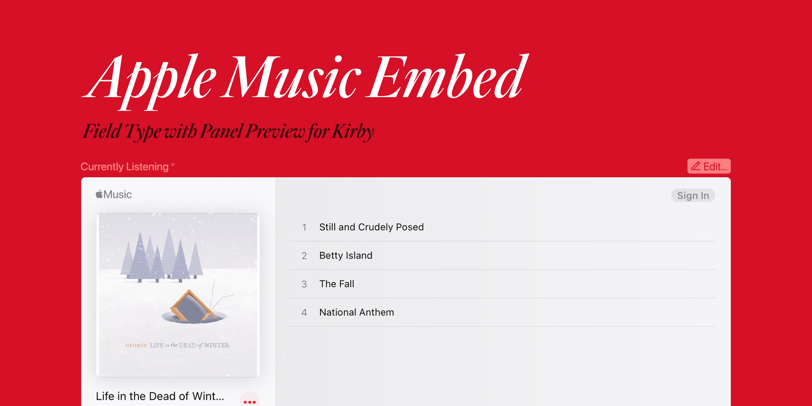

# Apple Music Embed Plugin for Kirby



Adds Apple Music Embed field and block types for Kirby including a live preview of the embed in the panel for each.

## Installation

### [Kirby CLI](https://github.com/getkirby/cli)
    
```bash
kirby plugin:install scottboms/kirby-applemusic
```

### Git submodule

```bash
git submodule add https://github.com/scottboms/kirby-applemusic.git site/plugins/kirby-applemusic
```

### Copy and Paste

1. [Download](https://github.com/scottboms/kirby-applemusic/archive/master.zip) the contents of this repository as Zip file.
2. Rename the extracted folder to `kirby-applemusic` and copy it into the `site/plugins/` directory in your Kirby project.

## Configuration

Version 1.1.0 adds an optional configuration setting which allows using either a link or embed code format in the field. If using the `link` format, the preview does the work of dynamically converting to show a live preview in the panel.
    
```php
return [
  scottboms.applemusic.format => 'embed | link'
]
```

## Usage

### Blueprints

In a Page blueprint, add a new field with the type `applemusic`. Standard field attributes such as `label`, `required`, `help`, etc. can also be used to override the defaults. Use `emptyText` to change the default text displayed when the field is in an empty state.

```yml
  music:
    label: Apple Music Embed
    type: applemusic
    emptyText: 'Click to paste Apple Music embed code'

  blocks:
    type: blocks
    fieldsets:
      - heading
      - text
      - image
      - applemusic
```

### Templates and Snippets

If using the defaults, and based on the example Blueprint above, to render the field in your template you can use `<?= $page->music() ?>`. Note that any additional helper functions applied may break the embed. You do not need to use `->kt()` or `->kti()` for example.

If using the `link` format, a custom snippet is included to handle formatting the link into a properly formatted `<iframe>` embed. For example:

```php
<?php snippet('applemusic', ['field' => $page->music()]) ?>
```

## Compatibility

* Kirby 4.x
* Kirby 5.x

## Disclaimer

This plugin is provided "as is" with no guarantee. Use it at your own risk and always test before using it in a production environment. If you identify an issue, typo, etc, please [create a new issue](/issues/new) so I can investigate.

## License

[MIT](https://opensource.org/licenses/MIT)
